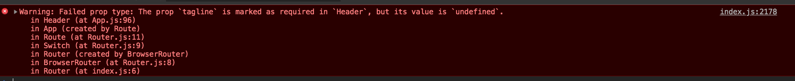
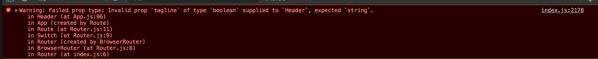

<!-- START doctoc generated TOC please keep comment here to allow auto update -->
<!-- DON'T EDIT THIS SECTION, INSTEAD RE-RUN doctoc TO UPDATE -->
**Table of Contents**  *generated with [DocToc](https://github.com/thlorenz/doctoc)*

- [React Course with Wes Bos](#react-course-with-wes-bos)
  - [Thinking and Understanding React Components](#thinking-and-understanding-react-components)
  - [Creating our First Components](#creating-our-first-components)
  - [Writing HTML with JSX](#writing-html-with-jsx)
  - [Loading CSS into our React Application](#loading-css-into-our-react-application)
  - [Creating our application layout with components](#creating-our-application-layout-with-components)
  - [Passing Dynamic data with props](#passing-dynamic-data-with-props)
    - [React Devtools Trick](#react-devtools-trick)
  - [Stateless Functional Components](#stateless-functional-components)
  - [Routing with React Router](#routing-with-react-router)
  - [Helper and Utility Functions](#helper-and-utility-functions)
  - [Events, Refs and this Binding](#events-refs-and-this-binding)
    - [Binding](#binding)
  - [Handling Events](#handling-events)
  - [Understanding State](#understanding-state)
  - [Loading data into state onClick](#loading-data-into-state-onclick)
  - [Displaying State with JSX](#displaying-state-with-jsx)
  - [Updating our Order State](#updating-our-order-state)
  - [Displaying Order State with JSX](#displaying-order-state-with-jsx)
  - [Persisting our State with Firebase](#persisting-our-state-with-firebase)
  - [Persisting Order State with localstorage](#persisting-order-state-with-localstorage)
  - [Bi-directional Data Flow and Live State Editing](#bi-directional-data-flow-and-live-state-editing)
  - [Removing Items from State](#removing-items-from-state)
  - [Animating React Components](#animating-react-components)
    - [Starting with mount/unmount:](#starting-with-mountunmount)
      - [Styles](#styles)
    - [Animating on Changes](#animating-on-changes)
  - [Component Validation with PropTypes](#component-validation-with-proptypes)
  - [Authentication](#authentication)
- [Original Readme: React For Beginners — ReactForBeginners.com](#original-readme-react-for-beginners--reactforbeginnerscom)
  - [To Start](#to-start)
    - [Code Use](#code-use)
- [Frequently Asked Questions](#frequently-asked-questions)
      - [:question: I'm getting error "Pre-built binaries not found for grpc@1.10.1 and node@10.3.0" and "Tried to download(403): https://storage.googleapis.com....."](#question-im-getting-error-pre-built-binaries-not-found-for-grpc1101-and-node1030-and-tried-to-download403-httpsstoragegoogleapiscom)
      - [:question: I tried installing the Babel syntax highlighter but it didn't work!](#question-i-tried-installing-the-babel-syntax-highlighter-but-it-didnt-work)
      - [:question: I can't set Babel as the default syntax highlighter!](#question-i-cant-set-babel-as-the-default-syntax-highlighter)
      - [:question: I can't see the React tab in my dev tools](#question-i-cant-see-the-react-tab-in-my-dev-tools)
      - [:question: `npm start` doesn't update the app on file save, or doesn't run correctly.](#question-npm-start-doesnt-update-the-app-on-file-save-or-doesnt-run-correctly)
  - [Changes In the 2018 RE-Record](#changes-in-the-2018-re-record)
  - [htaccess](#htaccess)

<!-- END doctoc generated TOC please keep comment here to allow auto update -->

# React Course with Wes Bos

> My course notes

## Thinking and Understanding React Components

Don't worry about views and models like other frameworks for now.

**Cmponent** Re-usable piece of website. React kind-of allows you to build your own tags. React dev tools shows components.

`App` is parent level component. React dev tools will show State. Changing state -> any component that depends on that portion of state is automatically updated, no need to explicitly select dom.

## Creating our First Components

To start will write in `index.js` then refactor to component file. Will build store picker component.

Weback takes in index.js and any files it requires and bundles it in one big js file `static/js/bundle.js`. Contains HMR code but that's only included for development, not production.

Start with importing React, then make a class. Best practice to start class names with capital.

Every class in React must have at least one method: `render`, which determines what dom elements should be rendered out to the page.

Need to _mount_ application for components to show up. This is the only time we touch the DOM directly.

Also need to import react-dom. Only need the `render` method from this package. Render needs some jsx and a mount point, a dom element to attach to:

```
render(<p>HEYYYYY!</p>, document.querySelector('#main'));
```

Since we made a StorePicker component, can use it as a tag and pass as first arg to render. Note self closing tag:

```javascript
render(<StorePicker />, document.querySelector("#main"));
```

Best practice is for each component to be stored in a separate file, eg: `src/components/StorePicker.js`. One way is to name the file the same as component class. Must export the class as default.

## Writing HTML with JSX

JSX allows mixing JavaScript and HTML in the same file. Not required to write React app, but most commonly used.

**JSX Gotchas**

- Use `className` instead of `class`.
- If returning multiple lines, wrap return in parens `()`, otherwise will break due to ASI.
- Cannot return sibling elements. Can only return one element - can be as many children inside as you like.
- For comments, use curly brackets and js comments `{ /* this is a comment */ }`
- Don't put comment outside of a tag though
- But if you need to return children with no wrapper (eg: flexbox), wrap with `<React.Fragment>`, which renders out to "nothing"

```javascript
import React from "react";

class StorePicker extends React.Component {
  render() {
    return (
      <React.Fragment>
        <p>Fish!</p>
        <form className="store-picker">
          {/* this is a comment */}
          <h2>Please Enter A Store</h2>
        </form>
      </React.Fragment>
    );
  }
}

export default StorePicker;
```

**To get Emmet working in VS Code with JSX**

```json
"emmet.syntaxProfiles": {
  "javascript": "jsx",
  "xml": {
    "attr_quotes": "single"
  }
},
"emmet.includeLanguages": {
  "javascript": "javascriptreact"
},
"emmet.triggerExpansionOnTab": true,
```

## Loading CSS into our React Application

A few different options. If integrating React into an existing app that already has css, edit `index.html` (or whatever if your app mounting point) and add a regular link tag:

```html
<link rel="stylesheet" href="style.css" />
```

Another option is "componentized css" - rather than one big css file, import css directly into component, where the css only relates to that component.

Can also import css into `index.js`, then it's available to entire app:

```javascript
import "./css/style.css";
```

From create-react-app, weback is configured to hot reload any css changes.

## Creating our application layout with components

App component will hold ALL children that make up app. This allows us to share data and methods across components.

Create new file `src/components/App.js`

It imports Header, Order and Inventory components to create the main app layout.

## Passing Dynamic data with props

Similar to HTML attributes, eg: img tag must have `src` and `alt`. Provide more info to tag so that it can render to page. Props are the way we get data into a component.

Data will live in app and we need a way to pass it down to children components.

State is where the data lives and Props is how the data gets to where it needs to go. State === Home, Props === Car.

For example, want to make tagline in Header dynamic.

There are no preset props, just make up whatever you need. For example, in Header.js:

```javascript
<Header tagline="Wes is Cool" />
```

Then React dev tools will show that Header component has Props tagline: "Wes is Cool"

Props is like object of data that got passed in to component, kind of like arguments object in a function.

To pass in anything other than a string, use `{}`:

```javascript
<Header tagline="Wes is Cool" age={500} cool={true} />
```

To access the props in the component that received them, recall `{}` in JSX means "I'm going back to just regular old JavaScript"

```javascript
<span>{this.props.tagline}</span>
```

`this` is component instance (eg: Header). `.props` is object inside component that contains properties.

### React Devtools Trick

Click on any compoennt from React tab, shows `$r`. This is similar to `$0` from Elements tab but for React, will show you everything that's available on the component when enter `$r` in Console tab, eg: props.

## Stateless Functional Components

If component only has render function (and prop types) and nothing else, can use stateless functional components. It's just a function that returns jsx. Instead of `this.props.foo`, function gets passed `props` as argument, then can use `props.foo` inside jsx. Can use arrow function and implicit return. Example:

```javascript
import React from "react";

const Header = props => (
  <header className="top">
    <h1>
      Catch
      <span className="ofThe">
        <span className="of">of</span>
        <span className="of">the</span>
      </span>
      Day
    </h1>
    <h3 className="tagline">
      <span>{props.tagline}</span>
    </h3>
  </header>
);

export default Header;
```

**Optional**

Can also destructure props into variables:

```javascript
const Header = ({ tagline, age }) => (
  <header ClassName="top">
    <span>{tagline}</span>
    <span>{age}</span>
  </header>
);
```

## Routing with React Router

Need to install a separate package `react-router-dom`, not baked into React.

Note that Router is also a component. Create a new component `src/components/Router.js`. Use `react-router-dom` to get push state in browser.

Make `Router` a stateless functional component.

`Switch` tag tries each `Route` from top to bottom, if first one doesn't match, goes to second etc.

`Route` component takes props such as `exact` to match a path exactly, `path` the route to match, and `component` what component to load when route is matched. Last entry is "catch all" for anything that didn't match previously, for example, put 404 not found here. This is done by not specifying any `path` for `Route`.

```javascript
// Router.js
import React from "react";
import { BrowserRouter, Route, Switch } from "react-router-dom";
import StorePicker from "./StorePicker";
import NotFound from "./NotFound";
import App from "./App";

const Router = () => (
  <BrowserRouter>
    <Switch>
      <Route exact path="/" component={StorePicker} />
      <Route path="/store/:storeId" component={App} />
      <Route component={NotFound} />
    </Switch>
  </BrowserRouter>
);

export default Router;
```

Must render `Router` component to mounting point to make use of it. Do this in `index.js`:

```javascript
// index.js
import React from "react";
import { render } from "react-dom";
import Router from "./components/Router";
import "./css/style.css";

render(<Router />, document.querySelector("#main"));
```

**React Devtools Tips**

- Use Search bar to quickly find a component that could be nested deeply within structure.
- Clicking on component that is target of the router (eg: App), Props will show `match` property that contains routing details including `params`, which will have for example: `storeId: "123"`.

## Helper and Utility Functions

Not specific to React, but general good practice on js projects. For example, helper function to format money, or generate a random name. Can place all this in `helpers.js`, which is NOT a react component. Export each function, i.e. named export, not default export:

```javascript
// helpers.js
export function formatPrice(cents) {
  ...
}

export function getFunName() {
  ...
}
...
```

To make use of a helper function, for example in StorePicker component. When component mounts to page, will run `getFunName` function and use its return value as `defaultValue` for `input` tag.

Note use of input `defaultValue` rather than `value`. Because `value` must be attached to state, more on this topic later.

```javascript
// StorePicker.js
import React from "react";
import { getFunName } from "../helpers";

class StorePicker extends React.Component {
  render() {
    return (
      <form className="store-selector">
        <h2>Please Enter A Store</h2>
        <input
          type="text"
          required
          placeholder="Store Name"
          defaultValue={getFunName()}
        />
        <button type="submit">Visit Store -></button>
      </form>
    );
  }
}

export default StorePicker;
```

## Events, Refs and this Binding

Events: Handling clicks, hover, form submit etc. Very similar to handling events in vanilla js except react wraps event in `SyntheticEvent`, which handls any cross browser/device differences between events.

Events are done inline. Specify event in camelCase, specify function to be executed, and define method in component. NOTE only the function reference is provided, NOT the function invocation, i.e. `this.handleClick`, NOT `this.handleClick()`. Reason is if added `()`, it would run when component mounts, which is not wanted. Want it to only run when button is clicked.

```javascript
class MyComponent extends React.Component {
  handleClick() {
    alert("Heyyy!");
  }
  render() {
    return (
      <form className="store-selector">
        <button onClick={this.handleClick}>Click me!</button>
      </form>
    );
  }
}
```

Can also listen to `obSubit` event for `form` element. If you do it naively like this, console log will be displayed, but then page will reload because that's the default browser action on form submission:

```javascript
class StorePicker extends React.Component {
  goToStore() {
    console.log("going to store...");
  }
  render() {
    return (
      <form className="store-selector" onSubmit={this.goToStore}>
        <h2>Please Enter A Store</h2>
        type="text" required placeholder="Store Name" defaultValue=
        {getFunName()}
        />
        <button type="submit">Visit Store -></button>
      </form>
    );
  }
}
```

But for SPA, this is undesirable, want to handle it client side, not server side. To do this, pass `event` object to form handler and call `preventDefault`:

```javascript
class StorePicker extends React.Component {
  goToStore(event) {
    event.preventDefault();
    console.log("going to store...");
  }
  render() {
    return (
      <form className="store-selector" onSubmit={this.goToStore}>
        <h2>Please Enter A Store</h2>
        type="text" required placeholder="Store Name" defaultValue=
        {getFunName()}
        />
        <button type="submit">Visit Store -></button>
      </form>
    );
  }
}
```

Now to implement `goToStore`, need to get text from input, but DO NOT REACH OUT TO DOM DIRECTLY!

Two options:

1. `refs`, which is kind of touching DOM, will do for this simple example hre.
2. Sync input with state (will do later in course)

`ref`: React solution for referencing a DOM node on the page.

```javascript
class StorePicker extends React.Component {
  myInput = React.createRef();

  goToStore(event) {
    // 1. Stop the form from submitting
    event.preventDefault();
    // 2. Get text from input -> error: this is undefined
    console.log(this.myInput);
    // 3. Change page to /store/whatever-they-entered
  }
  render() {
    return (
      <form className="store-selector" onSubmit={this.goToStore}>
        <h2>Please Enter A Store</h2>
        <input
          type="text"
          ref={this.myInput}
          required
          placeholder="Store Name"
          defaultValue={getFunName()}
        />
        <button type="submit">Visit Store -></button>
      </form>
    );
  }
}
```

### Binding

**ISSUE:** `this` is supposed to be instance of component but it's undefined in form submission handler `goToStore`, WHY??

Because of _binding_ in React...

All of the built-in React methods such as `render`, `componentDidMount` etc are within the parent `React.Component` so `this` refers to the component instance. But any new methods added to a component are not bound by default, therefore cannot reference the component in these. Need a solution because need to do things like `this.setState...` inside custom methods.

**SOLUTION:** Bind custom methods. One option is to use regular ES6 - add a `constructor`, which will run before component is created, then use function `bind` so that `this` in `goToStore` method will refer to component instance:

```javascript
class MyComponent extends React.Component {
  consturctor() {
    super(); // first create React.Component
    // bind all custom methods
    this.goToStore = this.goToStore.bind(this);
  }
  goToStore() {
    // ...
  }
  render() {
    // ...
  }
}
```

**ISSUE** with above solution: As more custom methods added, constructor gets clutterred with numerous bind statements.

**ALTERNATE SOLUTION** Define `goToStore` as a `property` of a class rather than a method, whose value is an arrow function. This will be bound to the instance:

```javascript
class MyComponent extends React.Component {
  goToStore = () => {
    console.log(this); // instance of MyComponent
  };
  render() {
    <form className="store-selector" onSubmit={this.goToStore}>
      ...
    </form>;
  }
}
```

**Anytime a custom method needs to reference component instance, define it as a property and arrow function.**

## Handling Events

Now that `this` binding is resolved, `this.myInput` is reference to `<input>` element:

```javascript
class StorePicker extends React.Component {
  myInput = React.createRef();

  goToStore = event => {
    // 1. Stop the form from submitting
    event.preventDefault();
    // 2. Get text from input
    console.log(this.myInput.value.value); // what user typed in
    // 3. Change page to /store/whatever-they-entered
  };
  render() {
    return (
      <form className="store-selector" onSubmit={this.goToStore}>
        <h2>Please Enter A Store</h2>
        <input
          type="text"
          ref={this.myInput}
          required
          placeholder="Store Name"
          defaultValue={getFunName()}
        />
        <button type="submit">Visit Store -></button>
      </form>
    );
  }
}
```

To change the page, do NOT use `window.location = ...` because that would cause entire page to refresh. Instead want to refresh the url with _push state_, which allows for changing url without refreshing or losing anything that's in-memory. Use react-router to do this.

To get access to router from `StorePicker` component, in this case easy because `StorePicker` is a child of Router:

```javascript
const Router = () => (
  <BrowserRouter>
    <Switch>
      <Route exact path="/" component={StorePicker} />
      <Route path="/store/:storeId" component={App} />
      <Route component={NotFound} />
    </Switch>
  </BrowserRouter>
);
```

In devtools, when StorePicker component is loaded as result of `http://localhost:3000/`:


Also as result of this relationship, `StorePicker` component has Props available to it from router, including `history.push`:


```javascript
goToStore = event => {
  // 1. Stop the form from submitting
  event.preventDefault();
  // 2. Get text from input
  const storeName = this.myInput.value.value; // what user typed in
  // 3. Change page to /store/whatever-they-entered
  this.props.history.push(`/store/${storeName}`);
};
```

When invoke `push` on router, react-router detects this and re-renders the component for which the new route matches, in this case, `App` component.

## Understanding State

State is an object that lives inside of a component that stores all of the data that component (and maybe some of its children) need.

Single source of truth! Concept is we should only need to update data in state, and let react take care of re-rendering whichever parts of DOM are affected and need to update as result of that data (aka state) change.

To demonstrate this, will build out Fish Order form in `Inventory` component. Actually Add Fish form should be a re-usable component `src/components/AddFishForm.js`:

When fish form is submitted, input values should be converted to fish obect.

Note that price is converted to a float so that price is stored as cents (otherwise its string).

```javascript
class AddFishForm extends React.Component {
  nameRef = React.createRef();
  priceRef = React.createRef();
  statusRef = React.createRef();
  descRef = React.createRef();
  imageRef = React.createRef();

  createFish = event => {
    // 1. stop the form from submitting
    event.preventDefault();
    // 2. make a fish object from form inputs
    const fish = {
      name: this.nameRef.value.value,
      price: parseFloat(this.priceRef.value.value),
      status: this.statusRef.value.value,
      desc: this.descRef.value.value,
      image: this.imageRef.value.value
    };
    console.log(fish);
  };

  render() {
    return (
      <form className="fish-edit" onSubmit={this.createFish}>
        <input name="name" ref={this.nameRef} type="text" placeholder="Name" />
        <input
          name="price"
          ref={this.priceRef}
          type="text"
          placeholder="Price"
        />
        <select name="status" ref={this.statusRef}>
          <option value="availale">Fresh</option>
          <option value="unavailable">Sold Out!</option>
        </select>
        <textarea name="desc" ref={this.descRef} placeholder="Desc" />
        <input
          name="image"
          ref={this.imageRef}
          type="text"
          placeholder="Image"
        />
        <button type="submit">+ Add Fish</button>
      </form>
    );
  }
}
```

Now that we have a `fish` object, how to get it into state?

Every component can have its own state, but usually have one parent state on a higher component, which gets passed down to all the children. Will use `App` component for this purpose.

Cannot pass data up from child to parent but can pass down from parent to child.

Start by adding initial/empty state to `App.js`. i.e. what should state look like before component mounts.

State can be defined in constructor or property (preferred).

```javascript
class App extends React.Component {
  state = {
    fishes: {},
    order: {}
  };

  render() {
    // ...
  }
}
```

Methods that update state and state object being updated need to live in same component.

Define class property arrow function on App for adding a fish to state:

```javascript
class App extends React.Component {
  state = {
    fishes: {},
    order: {}
  };

  addFish = fish => {
    // ...
  };

  render() {
    // ...
  }
}
```

`addFish` function lives in `App`, but want to invoke it from `AddFishForm` component which is two levels down.

Solution is to use props - have `App` component pass down `addFish` function as props to `Inventory` component, which in turn can pass it down to `AddFishForm`. By convention, keep prop name same as function name:

```javascript
class App extends React.Component {
  state = {
    fishes: {},
    order: {}
  };

  addFish = fish => {
    // ...
  };

  render() {
    return (
      // ...
      <Inventory addFish={this.addFish} />
    );
  }
}
```

Then `addFish` becomes available as prop in `Inventory` component, which can pass it down to `AddFishForm`. Notice it's `this.props.addFish` rather than `this.addFish` because `addFish` function isn't defined in `Inventory` component, rather, it received it via props from its parent `Inventory`:

```javascript
class Inventory extends React.Component {
  render() {
    return (
      <div className="inventory">
        <p>Inventory</p>
        <AddFishForm addFish={this.props.addFish} />
      </div>
    );
  }
}
```

Now `addFish` function can be invoked from `AddFishForm` component:

```javascript
class AddFishForm extends React.Component {
  createFish = event => {
    // 1. stop the form from submitting
    event.preventDefault();
    // 2. make a fish object from form inputs
    const fish = {
      name: this.nameRef.value.value,
      price: parseFloat(this.priceRef.value.value),
      status: this.statusRef.value.value,
      desc: this.descRef.value.value,
      image: this.imageRef.value.value
    };
    // 3. add the fish to list of fishes maintained by app
    this.props.addFish(fish);
  };
  render() {
    // ...
  }
}
```

Now back in `App` component, use react's `setState` method to update state. **Never update `state` directly!**

**Modifying state:**

1. Take a copy of the existing state - never want to reach into state to modify it - this is a mutation, causes performance issues, things updating out of order. Use object spread operator, eg: `const fishes = {...state.fishes}`. This is not a deep clone but that's fine.
2. Modify the copy.
3. Call `setState` to update state, passing in portion of state to be updated.

```javascript
class App extends React.Component {
  state = {
    fishes: {},
    order: {}
  };

  addFish = fish => {
    // 1. Take a copy of the existing state
    const fishes = { ...state.fishes };
    // 2. Modify the copy
    fishes[`fish${Date.now()}`] = fish;
    // 3. Update state
  };

  render() {
    // ...
  }
}
```

To test it out, open `App` component in react dev tools and observe State, then fill out Inventory form.

Should also reset form after it's submitted:

```javascript
class AddFishForm extends React.Component {
  createFish = event => {
    // ...
    event.currentTarget.reset();
  };

  render() {
    // ...
  }
}
```

## Loading data into state onClick

Goal: Create 'Load Sample Fishes' button that will load several fishes into state so we don't need to do manual data entry to run the app.

Start with `Inventory` component with button and click handler, but it invokes a function passed in via props:

```javascript
class Inventory extends React.Component {
  render() {
    return (
      <div className="inventory">
        <p>Inventory</p>
        <AddFishForm addFish={this.props.addFish} />
        <button onClick={this.props.loadSampleFishes}>
          Load Sample Fishes
        </button>
      </div>
    );
  }
}
```

The `loadSampleFishes` function will be defined on `App` component because it updates state, therefore must live in same component where state is defined:

```javascript
class App extends React.Component {
  loadSampleFishes = () => {};

  render() {
    // ...
    <Inventory
      addFish={this.addFish}
      loadSampleFishes={this.loadSampleFishes}
    />;
  }
}
```

To implement `loadSampleFishes`, make use of [catch-of-the-day/src/sample-fishes.js](catch-of-the-day/src/sample-fishes.js)

```javascript
import samplefishes from "../sample-fishes";
class App extends React.Component {
  loadSampleFishes = () => {
    this.setState({ fishes: samplefishes });
  };
}
```

## Displaying State with JSX

To display `fishes` from state in `App` component, add unordered list just below `Header`. Rather than implementing fish display directly in `App`, make it a `Fish` component so it could be re-used elsewhere.

In `App` component, want to _loop_ over all the `fishes` in state. JSX doesn't have any logic built into it such as looping or conditionals from other templating languages. Instead, logic is done with plain ol' javascript. In this case, `state.fishes` is an object so will use `Object.keys` to iterate.

```javascript
class App extends React.Component {
  render() {
    // ...
    <Header tagline="Fresh Seafood Market" />
    <ul className="fishes">
      {Object.keys(this.state.fishes).map(key => (
        <p>{key}</p>
      ))}
    </ul>
  }
}
```

At this point, will render, but see warning in console: `Each child in an array or iterator should have a unique "key"prop.`

In order for React to be performant, it needs to be able to get to component or portion of component that is updated. For any generated list of components, must provide a `key` property with any value that is unique:

```javascript
<ul className="fishes">
  {Object.keys(this.state.fishes).map(key => (
    <p key={key}>{key}</p>
  ))}
</ul>
```

To render `Fish` component rather than paragraph tag, still need `key` property:

```javascript
<ul className="fishes">
  {Object.keys(this.state.fishes).map(key => (
    <Fish key={key} />
  ))}
</ul>
```

In order for `Fish` component to have any data to render, pass it in via props from `App`:

```javascript
<ul className="fishes">
  {Object.keys(this.state.fishes).map(key => (
    <Fish key={key} details={this.state.fishes[key]} />
  ))}
</ul>
```

Now make use of `details` prop in `Fish` component. Notice no quotes around `src` and `alt` attributes of `img` tag. Also notice use of helper function to format price.

```javascript
import React from "react";
import { formatPrice } from "../helpers";

class Fish extends React.Component {
  render() {
    // Use ES6 destructuring to set multiple variables at once
    const { image, name, price, desc, status } = this.props.details;
    return (
      <li className="menu-fish">
        
        <h3 className="fish-name">
          {name}
          <span className="price">{formatPrice(price)}</span>
        </h3>
        <p>{desc}</p>
        <button>Add To Cart</button>
      </li>
    );
  }
}

export default Fish;
```

## Updating our Order State

'Add to Cart' button in `Fish` component should dispay as styled 'SOLD OUT' if item is sold out, otherwise as regular button that will add that fish item to the order.

Whether its sold out or not is controleld from Inventory status dropdown.

Modify `Fish` component, define `isAvailable` boolean depending on value of `status` (aka `this.props.details.status`), then use the opposite of isAvailable to control button disabled state. Also use ternary operator to set button text depending on availability:

```javascript
class Fish extends React.Component {
  render() {
    const { image, name, price, desc, status } = this.props.details;
    const isAvailable = status === "available";
    return (
      // ...
      <button disabled={!isAvailable}>
        {isAvailable ? "Add to Cart" : "Sold Out"}
      </button>
      // ...
    );
  }
}
```

To build up order object in state, will have fish key (eg: `fish1`), and value will be amount desired of that fish (1, 2, etc.).

Order state lives in `App` component so this is where an add to order function will be defined:

```javascript
class App extends React.Component {
  state = {
    fishes: {},
    order: {}
  };

  addToOrder = key => {
    // 1. take a copy of state
    const order = { ...this.state.order };
    // 2. add to order or update the number in our order
    order[key] = order[key] + 1 || 1;
    // 3. call setState to update order in state
    this.setState({ order });
  };

  // ...
}
```

To try out new `addToOrder` logic before hooking it up via props, can run manually with React dev tools. `$r` to get reference to `App` component, then invoke `$r.addToOrder('fish1')` in console. Then observe how `state.order` is updated.

After manual testing confirmed its working ok, pass `addToOrder` function into `Fish` component via props.

Since function needs to be invoked with fish `key`, have to pass that in as well with some prop name other than `key`, which is reserved by react. Even though specified with react `key={key}`, this is only available internally to react:

```javascript
class App extends React.Component {
  addToOrder = key => {
    // ...
  };
  render() {
    // ...
    <ul className="fishes">
      {Object.keys(this.state.fishes).map(key => (
        <Fish
          key={key}
          index={key}
          details={this.state.fishes[key]}
          addToOrder={this.addToOrder}
        />
      ))}
    </ul>;
  }
}
```

Then modify `Fish` component to invoke `addToOrder` function when button is clicked, providing `this.props.index` as the fish key:

```javascript
class Fish extends React.Component {
  handleClick = () => {
    this.props.addToOrder(this.props.index);
  };
  render() {
    // ...
    <button disabled={!isAvailable} onClick={this.handleClick}>
      {isAvailable ? "Add to Order" : "Sold Out"}
    </button>;
  }
}
```

Optionally, can also define the function inline:

```javascript
<button
  disabled={!isAvailable}
  onClick={() => this.props.addToOrder(this.props.index)}
>
  {isAvailable ? "Add to Order" : "Sold Out"}
</button>
```

## Displaying Order State with JSX

Will be working in `Order` component to display order state. Need to get `order` from state into `Order` component. Will also need the `fishes` from state which represents the inventory. As always, pass data into compoenents via props.

Starting from `App` component:

```javascript
class App extends React.Component {
  state = {
    fishes: {},
    order: {}
  };
  // ...
  render() {
    // ...
    <Order fishes={this.state.fishes} order={this.state.order} />;
  }
}
```

Note: Can also use object spread to pass in every key from state, but not good practice because there may be more in state than component strictly needs.

```javascript
<Order {...this.state} />
```

Now in `Order` component, need to sum up order total before displaying it. Use `reduce` function on `orderIds`, which are extracted from `this.props.order` using `Object.keys`.

Display orders in unordered list using `map` function on `orderIds`. Use _render function_ because the main `render` function is getting too big. When this happens, sign of doing too much in one component - either need to split up into multiple components, or keep in one component but write custom render function, eg: `renderOrder`.

When displaying individual fish details, need to check that fish is available.

As always, for any iterator, need to set `key` property.

```javascript
import React from "react";
import { formatPrice } from "../helpers";
class Order extends React.Component {
  renderOrder = key => {
    const fish = this.props.fishes[key];
    const count = this.props.order[key];
    const isAvailable = fish.status === "available";
    if (!isAvailable) {
      return (
        <li key={key}>
          Sorry {fish ? fish.name : "fish"} is no longer{" "}
          <available className="" />
        </li>
      );
    }
    return (
      <li key={key}>
        {count} lbs {fish.name}
        {formatPrice(count * fish.price)}
      </li>
    );
  };
  render() {
    const orderIds = Object.keys(this.props.order);
    const total = orderIds.reduce((prevTotal, key) => {
      const fish = this.props.fishes[key];
      const count = this.props.order[key];
      const isAvailable = fish && fish.status === "available";
      if (isAvailable) {
        return prevTotal + count * fish.price;
      }
      return prevTotal;
    }, 0);
    return (
      <div className="order-wrap">
        <h2>Order</h2>
        <ul className="order">{orderIds.map(this.renderOrder)}</ul>
        <div className="total">
          <strong>{formatPrice(total)}</strong>
        </div>
      </div>
    );
  }
}

export default Order;
```

## Persisting our State with Firebase

When page is refreshed, lose all inventory and order data. Will use Google service Firebase - real-time data persistence. Uses websockets to relay persisted data to all other connected clients.

Want to "mirror" state to Firebase. To get started:

- Create account or sign in with your Google account: [https://google.firebase.com](Firebase).
- Select Add project
- Enter project name such as "Catch of the day yourName"
- Select countru
- Create project
- After project created, click Develop from sidebar and select Database. Select Real-time database (not the beta Firestore).
- Temporarily change Rules to allow read/write to all (will change in auth section of this course later)

Click Project Overview fromsidebar, click web icon to add firebase to a web app. Make a note of config apiKey and other info.

Copy config object.

Back in project source, create new file `src/base.js`. Import `re-base` which is a react/firebase package to mirror state to firebase. Also import the official firebase package:

```javascript
// react Firebase package
import Rebase from "re-base";
// official firebase package
import firebase from "firebase";

// create and configre firebase app
const firebaseApp = firebase.initializeApp({
  apiKey: process.env.REACT_APP_FIREBASE_API_KEY,
  authDomain: process.env.REACT_APP_FIREBASE_AUTH_DOMAIN,
  databaseURL: process.env.REACT_APP_FIREBASE_DATABASE_URL
});

// create rebase binding
const base = Rebase.createClass(firebaseApp.database());

// This is a named export
export { firebaseApp };

// This is a default export
export default base;
```

Now modify `App` component to mirror fish state to firebase. Need to wait till component is on the page, then start syncing. Use react _lifecycle methods_. Will use `componentDidMount` - called as soon as component has been loaded on the page.

By convention, define lifecycle methods just after `state`, but beforoe all custom methods.

Firebase `ref` is reference to a piece of data, NOT react ref to a dom element.

Want to sync only with name of store, which comes from url. React router exposes props on target component (`App` in this case). Can get storeId from `this.props.match.params.storeId`.

```javascript
// other imports...
import base from "../base";

class App extends React.Component {
  state = {...}

  componentDidMount() {
    componentDidMount() {
      // extract params from data exposed by react-router
      const { params } = this.props.match;
      this.ref = base.syncState(`${params.storeId}/fishes`, {
        context: this,
        state: "fishes"
      });
    }
  }

  // other lifecycle methods as needed...

  // custom methods...

  render() {...}
}
```

Now run app, click Load Sample, then go to your Firebase database to see its been populated with fishes.

Also refresh the app and see how the sample fishes automatically load from firebase.

To avoid memory leak whenever `App` compounted is unmounted then re-mounted (eg: user going back to select a different store), need to cleanup re-base listener. i.e. `base.syncState` creates a listener, so need to "un-listen" when component is unmounted.

This is why we stored a reference to database earlier in `componentDidMount`: `this.ref = base.syncState(...)`, so now can use that reference to clean up:

```javascript
class App extends React.Component {
  componentWillUnmount() {
    base.removeBinding(this.ref);
  }
}
```

## Persisting Order State with localstorage

State `order` is not being persisted to Firebase. This section will show how to use localtorage for persistence.

Will be using another lifecycle method `componentDidUpdate`. Invoked after updating occurs. Want to update localstorage after order is updated.

`componentDidUpdate` is also called the very first time after `componentDidMount` because state is updated (via re-base sync state). At that point in time, the order is `{}` from initial state. Need to "hydrate" it from local storage if available. This part is done in `componentDidMount`.

Note that everything in localstorage is string.

```javascript
class App extends React.Component {
  componentDidMount() {
    // extract params from data exposed by react-router
    const { params } = this.props.match;
    // re-instate our localstorage
    const localStorageRef = localStorage.getItem(params.storeId);
    // update state if applicable
    if (localStorageRef) {
      this.setState({ order: JSON.parse(localStorageRef) });
    }
    this.ref = base.syncState(`${params.storeId}/fishes`, {
      context: this,
      state: "fishes"
    });
  }
  componentDidUpdate() {
    localStorage.setItem(
      this.props.match.params.storeId,
      JSON.stringify(this.state.order)
    );
  }
}
```

Note that `order` is being updated before firebase sync. This means `Order` component will re-render, but it also depends on `fishes`, which won't be available for another second or so until firebase resync. To prevent errors in `Order`, make sure `fish` exists, otherwise return null:

```javascript
class Order extends React.Component {
renderOrder = key => {
  const fish = this.props.fishes[key];
  const count = this.props.order[key];
  const isAvailable = fish && fish.status === "available";
  // Make sure the fish is loaded before we continue
  if (!fish) return null;
  // ...
};
```

## Bi-directional Data Flow and Live State Editing

Want to edit Inventory items and have them sync to firebase.

Create a new component `EditFishForm`. Set the value of inputs to come from corresponding prop on `fish`:

```javascript
class EditFishForm extends React.Component {
  render() {
    return (
      <div className="fish-edit">
        <input type="text" name="name" value={this.props.fish.name} />
        <input type="text" name="price" value={this.props.fish.price} />
        <select type="text" name="status" value={this.props.fish.status}>
          <option value="available">Fresh!</option>
          <option value="unavailable">Sold Out!</option>
        </select>
        <textarea name="desc" value={this.props.fish.desc} />
        <input type="text" name="image" value={this.props.fish.image} />
      </div>
    );
  }
}
```

Modify `App` to pass `fishes` into `Inventory` so that it can ultimately display an edit form for each fish in the inventory:

```javascript
class App extends React.Component {
  // ...
  render() {
    // ...
    <Inventory
      fishes={this.state.fishes}
      addFish={this.addFish}
      loadSampleFishes={this.loadSampleFishes}
    />;
  }
}
```

Add `EditFishForm` to `Inventory`, iterating over each fish, pass in fish instance to edit form so it can display the current fish value (description, price, etc.):

```javascript
class Inventory extends React.Component {
  render() {
    return (
      // ...
      <p>Inventory</p>
      {Object.keys(this.props.fishes).map(key => (
        <EditFishForm key={key} fish={this.props.fishes[key]} />
      ))}
      // ...
    )
  }
}
```

After doing all of the above, will see warning in console: "Warning: Failed prop type: You provided a `value` prop to a form field without an `onChange` handler. This will render a read-only field. If the field should be mutable use `defaultValue`. Otherwise, set either `onChange` or `readOnly`."

React will warn when state is put into an editable area without having anything to update it. So for now all the edit form fields are read-only. Because it would be bad to have state in more than once place.

Add onChange handler to `EditFishForm` inputs. `event.currentTaget` is the DOM node the event was fired on.

```javascript
class EditFishForm extends React.Component {
  handleChange = event => {
    console.log(event.currentTarget.value);
  };

  render() {
    return (
      <div className="fish-edit">
        <input
          type="text"
          name="name"
          onChange={this.handleChange}
          value={this.props.fish.name}
        />
        <input
          type="text"
          name="price"
          onChange={this.handleChange}
          value={this.props.fish.price}
        />
        <select
          type="text"
          name="status"
          onChange={this.handleChange}
          value={this.props.fish.status}
        >
          <option value="available">Fresh!</option>
          <option value="unavailable">Sold Out!</option>
        </select>
        <textarea
          name="desc"
          onChange={this.handleChange}
          value={this.props.fish.desc}
        />
        <input
          type="text"
          name="image"
          onChange={this.handleChange}
          value={this.props.fish.image}
        />
      </div>
    );
  }
}
```

But even with that, React will not update value of textbox even if user types into it, because its not in state. To do this, need to make a copy of current fish from props and update it. But this update needs to be dynamic because user could be updating any of the fields. To solve this, use _computed property name_. Use `event.currentTaget.name` as dynamic property to update. With this technique, only need one change handler that can handle change to any field, i.e. don't need `handleNameChange`, `handlePriceChange`, etc.

```javascript
class EditFishForm extends React.Component {
  handleChange = event => {
    // update that fish
    // 1. Take a copy of the current fish, overwriting the property that changed
    const updatedFish = {
      ...this.props.fish,
      [event.currentTarget.name]: event.currentTarget.value
    };
  };
}
```

To "push" this change up to App, back in `App` component, add an `updateFish` function, which can them be passed via props to `Inventory`, which can pass it to `EditFishForm`:

```javascript
class App extends React.Component {
  updateFish = (key, updatedFish) => {
    // 1. Take a copy of the current state
    const fishes = { ...this.state.fishes };
    // 2. Update that state
    fishes[key] = updatedFish;
    // 3. Set that to state
    this.setState({ fishes });
  };
  render() {
    //...
    <Inventory
      fishes={this.state.fishes}
      addFish={this.addFish}
      updateFish={this.updateFish}
      loadSampleFishes={this.loadSampleFishes}
    />;
  }
}
```

`Inventory` pass updateFish down to `EditFishForm`, also pass in key as index prop, will need it to callback `updateFish` function:

```javascript
class Inventory extends React.Component {
  render() {
    //...
    {
      Object.keys(this.props.fishes).map(key => (
        <EditFishForm
          key={key}
          index={key}
          fish={this.props.fishes[key]}
          updateFish={this.props.updateFish}
        />
      ));
    }
  }
}
```

Now make use of `updateFish` function in `EditFishForm`:

```javascript
class EditFishForm extends React.Component {
  handleChange = event => {
    // 1. Take a copy of the current fish, overwriting the property that changed
    const updatedFish = {
      ...this.props.fish,
      [event.currentTarget.name]: event.currentTarget.value
    };
    // 2. Update the fish
    this.props.updateFish(this.props.index, updatedFish);
  };
}
```

## Removing Items from State

Want to delete items from inventory and order. Start at `App` and add `deleteFish` function, then pass it to `Inventory`:

```javascript
class App extends React.Component {
  deleteFish = key => {
    // 1. take a copy of state
    const fishes = { ...this.state.fishes };
    // 2. update the state (set to null for firebase to update)
    fishes[key] = null;
    // 3. update state
    this.setState({ fishes });
  };
  render() {
    // ...
    <Inventory
      fishes={this.state.fishes}
      addFish={this.addFish}
      updateFish={this.updateFish}
      deleteFish={this.deleteFish}
      loadSampleFishes={this.loadSampleFishes}
    />;
  }
}
```

`Inventory` passes `deleteFish` function to `EditFishForm`:

```javascript
class Inventory extends React.Component {
  render() {
    // ...
    Object.keys(this.props.fishes).map(key => (
      <EditFishForm
        key={key}
        index={key}
        fish={this.props.fishes[key]}
        updateFish={this.props.updateFish}
        deleteFish={this.props.deleteFish}
      />
    ))}
  }
}
```

Add remove button to `EditFishForm` and hook it up to `deleteFish` function:

```javascript
class EditFishForm extends React.Component {
  render() {
    // ...
    <button onClick={() => this.props.deleteFish(this.props.index)}>
      Remove Fish
    </button>;
  }
}
```

Also want to delete item from order. Similar approach, start with `App`, define `removeFromOrder` and pass it to `Order` component:

```javascript
class App extends React.Component {
  removeFromOrder = key => {
    // 1. take a copy of state
    const order = { ...this.state.order };
    // 2. remove this order (not mirroring to firebase so delete is fine)
    delete order[key];
    // 3. call setState to update order in state
    this.setState({ order });
    // this should trigger componentDidUpdate and get localstorage updated as well
  };

  render() {
    // ...
    <ul className="fishes">
      {Object.keys(this.state.fishes).map(key => (
        <Fish
          key={key}
          index={key}
          details={this.state.fishes[key]}
          addToOrder={this.addToOrder}
          removeFromOrder={this.removeFromOrder}
          order={this.state.order}
        />
      ))}
    </ul>;
  }
}
```

Then add button to `Order` to invoke `removeFromOrder`:

```javascript
class Order extends React.Component {
  renderOrder = key => {
    // ...
    return (
      <li key={key}>
        {count} lbs {fish.name}
        {formatPrice(count * fish.price)}
        <button onClick={() => this.props.removeFromOrder(key)}>&times;</button>
      </li>
    );
  };
}
```

## Animating React Components

Two different kinds of animation:

1. Mounting/Unmounting components, eg: when a fish is added to order, it slides in on `Order` component, and when removed from Order, slides out. This is animation on `componentDidMount` and `componentWillUnmount1.
2. Animation on something changing.

### Starting with mount/unmount:

- Add some more imports to `Order`.
- Wrap the list of orders in `TransitionGroup` component, specifying what dom element it should render out, `ul` in this case.
- Wrap the `li` elements in `renderOrder` with `CSSTransition` element, which takes a few props:
  - `classNames`
  - `key`
  - `timeout`: Object of how fast items animate in/out, specified in ms
- Also the return `li` 'Sorry fish no longer available' needs to be wrapped in `CSSTransition` component. Later will show how to avoid some of this duplication.

```javascript
import { TransitionGroup, CSSTransition } from "react-transition-group";
class Order extends React.Component {
  renderOrder() {
    // ...
    if (!isAvailable) {
      return (
        <CSSTransition
          classNames="order"
          key={key}
          timeout={{ enter: 500, exit: 500 }}
        >
          <li key={key}>
            Sorry {fish ? fish.name : "fish"} is no longer{" "}
            <available className="" />
          </li>
        </CSSTransition>
      );
    }
    return (
      <CSSTransition
        classNames="order"
        key={key}
        timeout={{ enter: 250, exit: 250 }}
      >
        <li key={key}>
          {count} lbs {fish.name}
          {formatPrice(count * fish.price)}
          <button onClick={() => this.props.removeFromOrder(key)}>
            &times;
          </button>
        </li>
      </CSSTransition>
    );
  }
  render() {
    // ...
    <TransitionGroup component="ul" className="order">
      {orderIds.map(this.renderOrder)}
    </TransitionGroup>;
    // ...
  }
}
```

#### Styles

Comment out related styles in `_animations.styl`: order-enter/exit, count-enter/exit (note: stylus similar to sass but uses 2-space indentation, don't need semi-colons or curly braces).

Need to work it into the build, but with create-react-app, unable to modify webpack config unless `eject`. For this course, two additional npm run scripts available `styles` and `styles:watch`.

From terminal, stop app, then run `npm run styles:watch`. But that stops app.

`concurrently` will run multiple tasks at the same time: `npm run watch`.

To see what the `CSSTransition` component does (wrapped around each `li` in `Order`), change enter and exit values to 5000 (i.e. 5s), then watch Element tab of dev tools as order items are added/removed.

When a new `li` is added, some classes added to it for 5s, then removed:

```html
<li class="order-enter order-enter-active">...</li>
```

And when an existing `li` is removed, these classes added to it for 5s, then removed:

```html
<li class="order-exit order-exit-active">...</li>
```

These are the css classes you write to implement the animation.

Experiment to understand how this works, add to `_animations.styl`:

```styl
.order-enter
  background red
  &.order-enter-active
    background yellow
```

Will only see the yellow show up for 5s, now add in transition, and will see the item start red, and transition to yellow over 5s:

```styl
.order-enter
  background red
  transition 5s
  &.order-enter-active
    background yellow
```

The `order-enter` class is being added immediately, then 0.1ms later, adds class of `order-enter-active`. This allows you to transition any css properties from starting state `whatever-enter` to end state `whatever-enter-active`. Then after 5s (or whatever you confirmed on `CSSTransition` element, all the animation classes are removed).

To create a slide in from the left effect, use `translateX` with a value of -120%,to start the element hidden out of view, then transition it to `translateX` of 0 (i.e. just regular position):

```styl
.order-enter
  background red
  transform: translateX(-120%)
  transition 5s
  &.order-enter-active
    transform: translateX(0)
    background yellow
```

To create opposite effect on `order-exit`, start where it is, and when active, translateX to positive value beyond 100%:

```styl
.order-exit
  background thistle
  transform: translateX(0)
  transition 5s
  &.order-exit-active
    background palegoldenrod
    transform: translateX(120%)
```

Trick to transition height (because cannot transition from 0 to auto), use `max-height` and `padding` - will come in regular height then stretch vertically a bit, then go back to regular height. You may occasionally need `!important` to overwrite regular app styles:

```styl
.order-enter
  background red
  transform: translateX(-120%)
  transition 5s
  max-height 0
  padding 0 !important
  &.order-enter-active
    transform: translateX(0)
    max-height 60px
    background yellow
    padding 2rem 0 !important
```

To make animations "snappier", reduce transition in css to 0.5s, but also need to update enter/exit values on `CSSTransition` component to `500` (i.e. 500ms). Also get rid of colors (was just for experiment), final version:

```styl
.order-enter
  transform: translateX(-120%)
  transition 0.5s
  max-height 0
  padding 0 !important
  &.order-enter-active
    transform: translateX(0)
    max-height 60px
    padding 2rem 0 !important

.order-exit
  transform: translateX(0)
  transition 0.5s
  &.order-exit-active
    transform: translateX(120%)
    padding 0
```

To avoid repeating `CSSTransition` options, pull them out to const, then spread them into props:

```javascript
class Order extends React.Component {
  renderOrder = key => {
    // ...
    const transitionOptions = {
      classNames: "order",
      key,
      timeout: { enter: 500, exit: 500 }
    };
    // ...
    if (!isAvailable) {
      return (
        <CSSTransition {...transitionOptions}>
          <li key={key}>
            Sorry {fish ? fish.name : "fish"} is no longer{" "}
            <available className="" />
          </li>
        </CSSTransition>
      );
    }
    return (
      <CSSTransition {...transitionOptions}>
        <li key={key}>
          <span>
            <TransitionGroup component="span" className="count">
              <CSSTransition
                classNames="count"
                key={count}
                timeout={{ enter: 500, exit: 500 }}
              >
                <span>{count}</span>
              </CSSTransition>
            </TransitionGroup>
            lbs {fish.name}
            {formatPrice(count * fish.price)}
            <button onClick={() => this.props.removeFromOrder(key)}>
              &times;
            </button>
          </span>
        </li>
      </CSSTransition>
    );
  };
}
```

### Animating on Changes

When order is updated (eg: add a fish that's already there), quantity and price changes. This is not mount/unmount, but replacing a div that's already there. Eg: 1lb of Lobster already in order, when add another Lobster, want to animate `1` out of view and `2` into view.

Starter files for the React For Beginners course. Come <a href="https://ReactForBeginners.com/">Learn React</a> with me!

The code in this repo meant to be a reference point for anyone following along with the video course.

Start with `Order` component:

- Wrap count item in `span` element
- Wrap entire contents of `li` in `span`
- Wrap spanned count in `TransitionGroup`, specifying it should render a span with class of `count`
- Wrap spanned count in `CSSTransition`, specifying it should generate animation classes starting with `count`. By making the key `count` rather than `key`, will generate two spans, one for old count and one for new count.

```javascript
class Order extends React.Component {
  renderOrder = key => {
    // ...
    return (
      <CSSTransition
        classNames="order"
        key={key}
        timeout={{ enter: 500, exit: 500 }}
      >
        <li key={key}>
          <span>
            <TransitionGroup component="span" className="count">
              <CSSTransition
                classNames="count"
                key={count}
                timeout={{ enter: 5000, exit: 5000 }}
              >
                <span>{count}</span>
              </CSSTransition>
            </TransitionGroup>
            lbs {fish.name}
            {formatPrice(count * fish.price)}
            <button onClick={() => this.props.removeFromOrder(key)}>
              &times;
            </button>
          </span>
        </li>
      </CSSTransition>
    );
  };
}
```

Now observe dev tools for a fish already in order, then click Add to Order to increment the count:

Before:

```hrml
<span class="count>
  <span>6</span>
</span>
```

During - for duration specified in `CSSTransition` `timeout` prop - notice how teh new value is entered and the old value is exited:

```hrml
<span class="count>
  <span class="count-enter count-enter-active">7</span>
  <span class="count-exit count-exit-active">6</span>
</span>
```

After:

```hrml
<span class="count>
  <span>7</span>
</span>
```

Just like with mount/unmount, these classes are to be implemented in \_animations.styl. Use `translateY` to get top-to-bottom effect. Use absolute positioning to make the exiting span overlap the entering one:

```styl
.count-enter
  transition 0.5s
  // start the new count value underneath the old one
  transform translateY(100%)
  &.count-enter-active
    transform translateY(0)

.count-exit
  transition 0.5s
  position absolute
  left 0
  bottom 0
  // start at the bottom and go to the top
  transform translateY(0)
  &.count-exit-active
    transform translateY(-100%)
```

## Component Validation with PropTypes

PropTypes are for validating data that is being passed into a component via props to make sure its correct data type, shape etc.

eg, `Header` component accepts `tagline` props for displaying. How would someone know (without having to read entire component) that it takes a prop of `tagline` and expects it to be a string?

PropTypes allow to specify this ahead of time and provide warning in console if conditions not met.

Used to be built into react but now in a separate package `prop-types`.

Example, `isRequired` is optional to add if it must be provided.

```javascript
import React from "react";
import PropTypes fro 'prop-types';

const Header = props => (
  // ...
);

Header.propTypes = {
  tagline: PropTypes.string.isRequired
};
```

It's defined at end of file `Header.propTypes = ...` because `Header` is a stateless functional component.

To see PropTypes validation in action, temporarily edit `App` component, remove tagline from Header:

```javascript
class App extends React.Component {
  render() {
    // ...
    <Header />;
  }
}
```

Will see warning in console:



Try passing in tagline as boolean:

```javascript
class App extends React.Component {
  render() {
    // ...
    <Header />;
  }
}
```

Then console shows:



Console errors are development helpers, they don't show up in production.

Read the [docs](https://reactjs.org/docs/typechecking-with-proptypes.html#proptypes) for all options.

`shape` is useful for describing object props.

Add proptypes for all our components so far.

`Fish` is a regular react component so we can use `static propTypes = ...` Use `static` because propTypes is being declared once for _all_ instances of `Fish` component.

`details` is an object, could use PropTypes.object but that's too lenient, would pass for any object. We need an object that has specific properties: image, name, price, etc. Use `shape` which is a function that accepts an object - here specify all the properties `details` should have:

```javascript
class Fish extends React.Component {
  static propTypes = {
    addToOrder: PropTypes.func,
    details: PropTypes.shape({
      image: PropTypes.string,
      name: PropTypes.string,
      desc: PropTypes.string,
      status: PropTypes.string,
      price: PropTypes.number
    })
  };
  // ...
}
```

**Good Practice:** Anytime you start writing `this.props...` in a component, stop and add a PropType for it.

For `App` component, it only needs `match` prop from react-router. Can assume it will be providing the correct shape so just declare it as object:

```javascript
class App extends React.Component {
  state = {...}

  static propTypes = {
    match: PropTypes.object
  };

  // ...
}
```

## Authentication

Currently app is completely open, anyone can open it and load/delete whatever they wish. Need to lock it down so that only person that owns the store is allowed to modify inventory, delete etc.

Will add Github, Facebook and Twitter login. When you login will assign you as owner of that store. If you then logout and login as someone else, will not be allowed to edit store.

Will do with Firebase -> Authentication. Add Sign-in providers:

**Facebook:**

- Asks for App ID and App secret and provides a callback url.
- Go to facebook.developers.com and add new app: Catch of the Day
- Settings - Basic: Grap App ID and App Secret and paste into Firebase screen (have to enable)

**NEVER SHARE APP SECRET!!!** That's why it goes into Firebase.

- Take the url generated by firebase and go back to facebook app settings -> Dashboard -> Facebook Login
- www -> put any site url
- click Next through remainder of steps
- will see Settings in sidebar under Facebook Login -> turn on Embedded Browser OAuth Login
- Paste url from firebase into Valid OAuth Redirect URIs
- Click Save changes in Facebook dev
- Click Save in Firebase

Create new `Login` component:

```javascript
const Login = props => (
  <nav className="Login">
    <h2>Inventory Login</h2>
    <p>Sign in to manage your store's inventory.</p>
    <button className="facebook" onClick={() => props.authenticate("Facebook")}>
      Log In With Facebook
    </button>
  </nav>
);
```

Use `Login` into `Inventory` component. `authenticate` function will create a new auth provider. Dynamically lookup function name so we don't need if statement to support multiple providers.

```javascript
import firebase from 'firebase';
// this is how you import both default and named exports
import base, { firebaseApp } from "../base";
// other imports...

class Inventory extends React.Component {
  authenticate = provider => {
    const authProvider = new firebase.auth[`${provider}AuthProvider`]();
    firebaseApp
      .auth()
      .signInWithPopup(authProvider)
      .then(this.authHandler)
      .catch(this.authError);
  };
  render() {
    return <Login authenticate={this.authenticate} />;
  }
}
```

Currently `Inventory` doesn't know the store name, which it will need to find the store in firbease. That's known one level higher in `App` based on router params (`this.props.match.params.storeId`). Modify `App` to pass store name into `Inventory`:

```javascript
class App extends React.Component {
  render() {
    // ...
    <Inventory
      fishes={this.state.fishes}
      addFish={this.addFish}
      updateFish={this.updateFish}
      deleteFish={this.deleteFish}
      loadSampleFishes={this.loadSampleFishes}
      storeId={this.props.match.params.storeId}
    />
  }
}
```

Back in `Inventory`, after `signInWithPopup`, goes to `authHandler`, which is `async` because need to `await` results of looking up the store name in firebase.

In this case, storing state local to the `Inventory` component because its not needed anywhere else.

```javascript
class Inventory extends React.Component {
  authHandler = async authData => {
    // 1. Look up the currentstore in the firebase database
    const store = await base.fetch(this.props.storeId, { context: this });
    // 2. Claim it if there is no owner
    if (!store.owner) {
      // save it as our own
      await base.post(`${this.props.storeId}/owner`, {
        data: authData.user.uid
      });
    }
    // 3. Set the state of the inventory component to reflect the current user
    this.setState({
      uid: authData.user.uid,
      owner: store.owner || authData.user.uid
    });
  };
}
```

Now modify `render` of `Inventory` to check if user is logged in, or if they are logged in, are they owner of store?

Also need a logout button. Since it's needed in two places, put the jsx in a const, then use that wherever needed. Will also need a `logout` method.

```javascript
class Inventory extends React.Component {
  logout = async () => {
    console.log("logging out");
    await firebase.auth().signOut();
    this.setState({ uid: null });
  };

  render() {
    const logout = <button onClick={this.logout}>Log Out!</button>;

    render() {
        // 1. Check if they are logged in
        if (!this.state.uid) {
          return <Login authenticate={this.authenticate} />;
        }
        // 2. Check if logged in user is not owner of the store
        if (this.state.uid !== this.state.owner) {
          return (
            <div>
              <p>Sorry you are not the owner!</p>
              {logout}
            </div>
          );
        }
        // 3. They must be the owner, just render the inventory
        return (
          <div className="inventory">
            <p>Inventory</p>
            {logout}
            // ...
          </div>
        );
      }
    }
  }
}
```

Currently, if refresh the page, loses the login state. To fix this, listen for `componentDidMount`, and ask firebase if there is a logged in user, if yes, pass this user to authHandler.

```javascript
class Inventory extends React.Component {
  componentDidMount() {
    firebase.auth().onAuthStateChanged(user => {
      if (user) {
        this.authHandler({user})
      }
    })
  }
}
```

**Everything up to now is only UI, not real security. Still need to lock down Firebase with rules:**

Database -> Rules

See `security-rules.json` - Firebase uses javascript. Copy those rules to firebase.

## Building React for Production

Kill the dev mode app/watch that's currently running. Then run:

```shell
npm run build
```

Takes all js, css and compiles into one smaller js bundle, strips out warnings, proptypes. Creates a `build` dir.

`static` subdir has js containing js bundle and .map file which is larger, but not loaded by users. Sourcemap only loaded by developers when debugging.

`media` subdir has images and fonts.

`css` subdir has one css file, webpack took the imported css and made an external file.

`index.html` is modfied to point to the js and css.

Example output:

```
> cotd@0.0.3 build /Users/dbaron/projects/wes-bos/react-course-wesbos/catch-of-the-day
> react-scripts build

Creating an optimized production build...
Compiled successfully.

File sizes after gzip:

  180.38 KB  build/static/js/main.9ffdc1e9.js
  2.87 KB    build/static/css/main.88c59a0a.css

The project was built assuming it is hosted at the server root.
You can control this with the homepage field in your package.json.
For example, add this to build it for GitHub Pages:

  "homepage" : "http://myname.github.io/myapp",

The build folder is ready to be deployed.
You may serve it with a static server:

  serve -s build

Find out more about deployment here:

  http://bit.ly/2vY88Kr
```

The `build` dir is a static site - can take it and send to any static hosting provider.

HOWEVER, server needs to be configured to always look at index.html, no matter what the url is. eg: `https://somedomain.com/store/elegant-thoughtless-diagnoses` Server should NOT look in a subdir named `store`, it should always read index.html because this is a single page app with client side routing.

# Original Readme: React For Beginners — [ReactForBeginners.com](https://ReactForBeginners.com)

## To Start

**Note** - one of the dependencies is currently not working with Node.js 10.3, please use [version 9.11.1](https://nodejs.org/download/release/v9.11.1/) (or around that, 8.x and 9.x should work fine) until then.

`cd` into `catch-of-the-day` and follow along with the videos

Each numbered folder in `stepped-solutions` contains the files for the beginning of each correspondingly numbered video, should you need them. So, if you need any code, pull the appropriate file into your `catch-of-the-day` folder.

You are welcome to submit Pull Requests but I'd like to keep the code as similar as possible to the course content.

### Code Use

You are welcome to use this code in your own applications. If you would like to use it for training purposes, please shoot me a message first to make sure it's okay.

# Frequently Asked Questions

#### :question: I'm getting error "Pre-built binaries not found for grpc@1.10.1 and node@10.3.0" and "Tried to download(403): https://storage.googleapis.com....."

One of the dependencies is currently not working with Node.js 10.3, please use [version 9.11.1](https://nodejs.org/download/release/v9.11.1/) (or around that, 8.x and 9.x should work fine) until then. Don't sweat this as it's just build tooling and isn't related to the version of react you are using.

#### :question: I tried installing the Babel syntax highlighter but it didn't work!

There are a few possible options:

- If you are on Sublime Text 2, you should Upgrade to Sublime Text 3.
- Some users have reported restarting works
- You can try the [JavaScript Next](https://packagecontrol.io/packages/JavaScriptNext%20-%20ES6%20Syntax) syntax highlighter instead

#### :question: I can't set Babel as the default syntax highlighter!

Make sure you are in a file with the extension of `.js` before you do this step - you can't set the default for a file without having a file open!

#### :question: I can't see the React tab in my dev tools

Restart your dev tools or your chrome browser entirely. They will only show up when you are viewing a React app - so make sure you test it on Facebook or another website that is running React. It won't work on your empty `main.js` file until you `import React from 'react'`.

#### :question: `npm start` doesn't update the app on file save, or doesn't run correctly.

There may be a few different causes for this:

- Webpack currently can't handle folder/file names that contain parentheses.
- Webpack also has problems running inside folders for Dropbox/Google Drive type services. Git is recommended for keeping your files in sync across multiple computers.

## Changes In the 2018 RE-Record

In March 2018 I re-recorded this course. Here are the things that I've updated.

- Upgrade to React Router 4 Final API
- Use React 16.3
- Move to external PropTypes Package
- Use React's new Refs API, remove function refs
- Remove all use of constructors and super() - use class properties instead
- Better explain binding, use of `this` and component instances
- Moved from React-addons-css-transition-group to react-transition-group and upgraded from 1.x to 2.x
- Use official Firebase package for Auth as re-base is now only for data binding
- Move promise based code to async/await
- Show how to return multiple elements with React.Fragment

## htaccess

Here is the .htaccess file we use in the apache deployment video

```

RewriteBase /
RewriteRule ^index\.html\$ - [L]
RewriteCond %{REQUEST_FILENAME} !-f
RewriteCond %{REQUEST_FILENAME} !-d
RewriteRule . /index.html [L]

```

```

```
