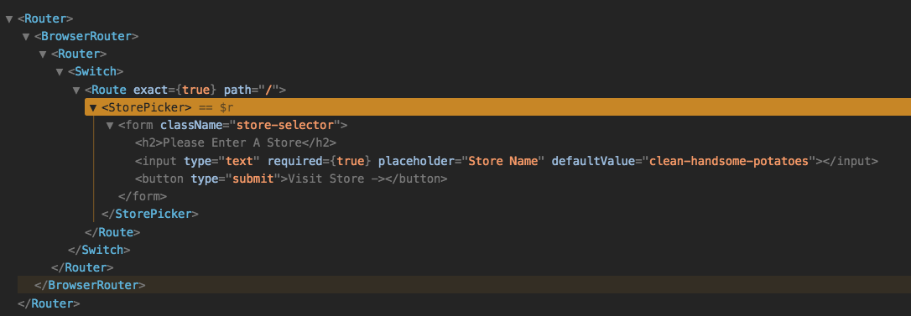
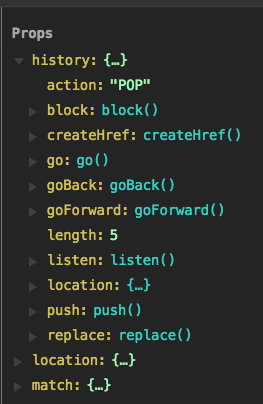

# React Course with Wes Bos

> My course notes

## Thinking and Understanding React Components

Don't worry about views and models like other frameworks for now.

**Cmponent** Re-usable piece of website. React kind-of allows you to build your own tags. React dev tools shows components.

`App` is parent level component. React dev tools will show State. Changing state -> any component that depends on that portion of state is automatically updated, no need to explicitly select dom.

## Creating our First Components

To start will write in `index.js` then refactor to component file. Will build store picker component.

Weback takes in index.js and any files it requires and bundles it in one big js file `static/js/bundle.js`. Contains HMR code but that's only included for development, not production.

Start with importing React, then make a class. Best practice to start class names with capital.

Every class in React must have at least one method: `render`, which determines what dom elements should be rendered out to the page.

Need to _mount_ application for components to show up. This is the only time we touch the DOM directly.

Also need to import react-dom. Only need the `render` method from this package. Render needs some jsx and a mount point, a dom element to attach to:

```
render(<p>HEYYYYY!</p>, document.querySelector('#main'));
```

Since we made a StorePicker component, can use it as a tag and pass as first arg to render. Note self closing tag:

```javascript
render(<StorePicker />, document.querySelector("#main"));
```

Best practice is for each component to be stored in a separate file, eg: `src/components/StorePicker.js`. One way is to name the file the same as component class. Must export the class as default.

## Writing HTML with JSX

JSX allows mixing JavaScript and HTML in the same file. Not required to write React app, but most commonly used.

**JSX Gotchas**

- Use `className` instead of `class`.
- If returning multiple lines, wrap return in parens `()`, otherwise will break due to ASI.
- Cannot return sibling elements. Can only return one element - can be as many children inside as you like.
- For comments, use curly brackets and js comments `{ /* this is a comment */ }`
- Don't put comment outside of a tag though
- But if you need to return children with no wrapper (eg: flexbox), wrap with `<React.Fragment>`, which renders out to "nothing"

```javascript
import React from "react";

class StorePicker extends React.Component {
  render() {
    return (
      <React.Fragment>
        <p>Fish!</p>
        <form className="store-picker">
          {/* this is a comment */}
          <h2>Please Enter A Store</h2>
        </form>
      </React.Fragment>
    );
  }
}

export default StorePicker;
```

**To get Emmet working in VS Code with JSX**

```json
"emmet.syntaxProfiles": {
  "javascript": "jsx",
  "xml": {
    "attr_quotes": "single"
  }
},
"emmet.includeLanguages": {
  "javascript": "javascriptreact"
},
"emmet.triggerExpansionOnTab": true,
```

## Loading CSS into our React Application

A few different options. If integrating React into an existing app that already has css, edit `index.html` (or whatever if your app mounting point) and add a regular link tag:

```html
<link rel="stylesheet" href="style.css" />
```

Another option is "componentized css" - rather than one big css file, import css directly into component, where the css only relates to that component.

Can also import css into `index.js`, then it's available to entire app:

```javascript
import "./css/style.css";
```

From create-react-app, weback is configured to hot reload any css changes.

## Creating our application layout with components

App component will hold ALL children that make up app. This allows us to share data and methods across components.

Create new file `src/components/App.js`

It imports Header, Order and Inventory components to create the main app layout.

## Passing Dynamic data with props

Similar to HTML attributes, eg: img tag must have `src` and `alt`. Provide more info to tag so that it can render to page. Props are the way we get data into a component.

Data will live in app and we need a way to pass it down to children components.

State is where the data lives and Props is how the data gets to where it needs to go. State === Home, Props === Car.

For example, want to make tagline in Header dynamic.

There are no preset props, just make up whatever you need. For example, in Header.js:

```javascript
<Header tagline="Wes is Cool" />
```

Then React dev tools will show that Header component has Props tagline: "Wes is Cool"

Props is like object of data that got passed in to component, kind of like arguments object in a function.

To pass in anything other than a string, use `{}`:

```javascript
<Header tagline="Wes is Cool" age={500} cool={true} />
```

To access the props in the component that received them, recall `{}` in JSX means "I'm going back to just regular old JavaScript"

```javascript
<span>{this.props.tagline}</span>
```

`this` is component instance (eg: Header). `.props` is object inside component that contains properties.

### React Devtools Trick

Click on any compoennt from React tab, shows `$r`. This is similar to `$0` from Elements tab but for React, will show you everything that's available on the component when enter `$r` in Console tab, eg: props.

## Stateless Functional Components

If component only has render function (and prop types) and nothing else, can use stateless functional components. It's just a function that returns jsx. Instead of `this.props.foo`, function gets passed `props` as argument, then can use `props.foo` inside jsx. Can use arrow function and implicit return. Example:

```javascript
import React from "react";

const Header = props => (
  <header className="top">
    <h1>
      Catch
      <span className="ofThe">
        <span className="of">of</span>
        <span className="of">the</span>
      </span>
      Day
    </h1>
    <h3 className="tagline">
      <span>{props.tagline}</span>
    </h3>
  </header>
);

export default Header;
```

**Optional**

Can also destructure props into variables:

```javascript
const Header = ({ tagline, age }) => (
  <header ClassName="top">
    <span>{tagline}</span>
    <span>{age}</span>
  </header>
);
```

## Routing with React Router

Need to install a separate package `react-router-dom`, not baked into React.

Note that Router is also a component. Create a new component `src/components/Router.js`. Use `react-router-dom` to get push state in browser.

Make `Router` a stateless functional component.

`Switch` tag tries each `Route` from top to bottom, if first one doesn't match, goes to second etc.

`Route` component takes props such as `exact` to match a path exactly, `path` the route to match, and `component` what component to load when route is matched. Last entry is "catch all" for anything that didn't match previously, for example, put 404 not found here. This is done by not specifying any `path` for `Route`.

```javascript
// Router.js
import React from "react";
import { BrowserRouter, Route, Switch } from "react-router-dom";
import StorePicker from "./StorePicker";
import NotFound from "./NotFound";
import App from "./App";

const Router = () => (
  <BrowserRouter>
    <Switch>
      <Route exact path="/" component={StorePicker} />
      <Route path="/store/:storeId" component={App} />
      <Route component={NotFound} />
    </Switch>
  </BrowserRouter>
);

export default Router;
```

Must render `Router` component to mounting point to make use of it. Do this in `index.js`:

```javascript
// index.js
import React from "react";
import { render } from "react-dom";
import Router from "./components/Router";
import "./css/style.css";

render(<Router />, document.querySelector("#main"));
```

**React Devtools Tips**

- Use Search bar to quickly find a component that could be nested deeply within structure.
- Clicking on component that is target of the router (eg: App), Props will show `match` property that contains routing details including `params`, which will have for example: `storeId: "123"`.

## Helper and Utility Functions

Not specific to React, but general good practice on js projects. For example, helper function to format money, or generate a random name. Can place all this in `helpers.js`, which is NOT a react component. Export each function, i.e. named export, not default export:

```javascript
// helpers.js
export function formatPrice(cents) {
  ...
}

export function getFunName() {
  ...
}
...
```

To make use of a helper function, for example in StorePicker component. When component mounts to page, will run `getFunName` function and use its return value as `defaultValue` for `input` tag.

Note use of input `defaultValue` rather than `value`. Because `value` must be attached to state, more on this topic later.

```javascript
// StorePicker.js
import React from "react";
import { getFunName } from "../helpers";

class StorePicker extends React.Component {
  render() {
    return (
      <form className="store-selector">
        <h2>Please Enter A Store</h2>
        <input
          type="text"
          required
          placeholder="Store Name"
          defaultValue={getFunName()}
        />
        <button type="submit">Visit Store -></button>
      </form>
    );
  }
}

export default StorePicker;
```

## Events, Refs and this Binding

Events: Handling clicks, hover, form submit etc. Very similar to handling events in vanilla js except react wraps event in `SyntheticEvent`, which handls any cross browser/device differences between events.

Events are done inline. Specify event in camelCase, specify function to be executed, and define method in component. NOTE only the function reference is provided, NOT the function invocation, i.e. `this.handleClick`, NOT `this.handleClick()`. Reason is if added `()`, it would run when component mounts, which is not wanted. Want it to only run when button is clicked.

```javascript
class MyComponent extends React.Component {
  handleClick() {
    alert("Heyyy!");
  }
  render() {
    return (
      <form className="store-selector">
        <button onClick={this.handleClick}>Click me!</button>
      </form>
    );
  }
}
```

Can also listen to `obSubit` event for `form` element. If you do it naively like this, console log will be displayed, but then page will reload because that's the default browser action on form submission:

```javascript
class StorePicker extends React.Component {
  goToStore() {
    console.log("going to store...");
  }
  render() {
    return (
      <form className="store-selector" onSubmit={this.goToStore}>
        <h2>Please Enter A Store</h2>
        type="text" required placeholder="Store Name" defaultValue=
        {getFunName()}
        />
        <button type="submit">Visit Store -></button>
      </form>
    );
  }
}
```

But for SPA, this is undesirable, want to handle it client side, not server side. To do this, pass `event` object to form handler and call `preventDefault`:

```javascript
class StorePicker extends React.Component {
  goToStore(event) {
    event.preventDefault();
    console.log("going to store...");
  }
  render() {
    return (
      <form className="store-selector" onSubmit={this.goToStore}>
        <h2>Please Enter A Store</h2>
        type="text" required placeholder="Store Name" defaultValue=
        {getFunName()}
        />
        <button type="submit">Visit Store -></button>
      </form>
    );
  }
}
```

Now to implement `goToStore`, need to get text from input, but DO NOT REACH OUT TO DOM DIRECTLY!

Two options:

1. `refs`, which is kind of touching DOM, will do for this simple example hre.
2. Sync input with state (will do later in course)

`ref`: React solution for referencing a DOM node on the page.

```javascript
class StorePicker extends React.Component {
  myInput = React.createRef();

  goToStore(event) {
    // 1. Stop the form from submitting
    event.preventDefault();
    // 2. Get text from input -> error: this is undefined
    console.log(this.myInput);
    // 3. Change page to /store/whatever-they-entered
  }
  render() {
    return (
      <form className="store-selector" onSubmit={this.goToStore}>
        <h2>Please Enter A Store</h2>
        <input
          type="text"
          ref={this.myInput}
          required
          placeholder="Store Name"
          defaultValue={getFunName()}
        />
        <button type="submit">Visit Store -></button>
      </form>
    );
  }
}
```

### Binding

**ISSUE:** `this` is supposed to be instance of component but it's undefined in form submission handler `goToStore`, WHY??

Because of _binding_ in React...

All of the built-in React methods such as `render`, `componentDidMount` etc are within the parent `React.Component` so `this` refers to the component instance. But any new methods added to a component are not bound by default, therefore cannot reference the component in these. Need a solution because need to do things like `this.setState...` inside custom methods.

**SOLUTION:** Bind custom methods. One option is to use regular ES6 - add a `constructor`, which will run before component is created, then use function `bind` so that `this` in `goToStore` method will refer to component instance:

```javascript
class MyComponent extends React.Component {
  consturctor() {
    super(); // first create React.Component
    // bind all custom methods
    this.goToStore = this.goToStore.bind(this);
  }
  goToStore() {
    // ...
  }
  render() {
    // ...
  }
}
```

**ISSUE** with above solution: As more custom methods added, constructor gets clutterred with numerous bind statements.

**ALTERNATE SOLUTION** Define `goToStore` as a `property` of a class rather than a method, whose value is an arrow function. This will be bound to the instance:

```javascript
class MyComponent extends React.Component {
  goToStore = () => {
    console.log(this); // instance of MyComponent
  };
  render() {
    <form className="store-selector" onSubmit={this.goToStore}>
      ...
    </form>;
  }
}
```

**Anytime a custom method needs to reference component instance, define it as a property and arrow function.**

## Handling Events

Now that `this` binding is resolved, `this.myInput` is reference to `<input>` element:

```javascript
class StorePicker extends React.Component {
  myInput = React.createRef();

  goToStore = event => {
    // 1. Stop the form from submitting
    event.preventDefault();
    // 2. Get text from input
    console.log(this.myInput.value.value); // what user typed in
    // 3. Change page to /store/whatever-they-entered
  };
  render() {
    return (
      <form className="store-selector" onSubmit={this.goToStore}>
        <h2>Please Enter A Store</h2>
        <input
          type="text"
          ref={this.myInput}
          required
          placeholder="Store Name"
          defaultValue={getFunName()}
        />
        <button type="submit">Visit Store -></button>
      </form>
    );
  }
}
```

To change the page, do NOT use `window.location = ...` because that would cause entire page to refresh. Instead want to refresh the url with _push state_, which allows for changing url without refreshing or losing anything that's in-memory. Use react-router to do this.

To get access to router from `StorePicker` component, in this case easy because `StorePicker` is a child of Router:

```javascript
const Router = () => (
  <BrowserRouter>
    <Switch>
      <Route exact path="/" component={StorePicker} />
      <Route path="/store/:storeId" component={App} />
      <Route component={NotFound} />
    </Switch>
  </BrowserRouter>
);
```

In devtools, when StorePicker component is loaded as result of `http://localhost:3000/`:



Also as result of this relationship, `StorePicker` component has Props available to it from router, including `history.push`:



```javascript
goToStore = event => {
  // 1. Stop the form from submitting
  event.preventDefault();
  // 2. Get text from input
  const storeName = this.myInput.value.value; // what user typed in
  // 3. Change page to /store/whatever-they-entered
  this.props.history.push(`/store/${storeName}`);
};
```

When invoke `push` on router, react-router detects this and re-renders the component for which the new route matches, in this case, `App` component.

## Understanding State

State is an object that lives inside of a component that stores all of the data that component (and maybe some of its children) need.

Single source of truth! Concept is we should only need to update data in state, and let react take care of re-rendering whichever parts of DOM are affected and need to update as result of that data (aka state) change.

To demonstrate this, will build out Fish Order form in `Inventory` component. Actually Add Fish form should be a re-usable component `src/components/AddFishForm.js`:

When fish form is submitted, input values should be converted to fish obect.

Note that price is converted to a float so that price is stored as cents (otherwise its string).

```javascript
class AddFishForm extends React.Component {
  nameRef = React.createRef();
  priceRef = React.createRef();
  statusRef = React.createRef();
  descRef = React.createRef();
  imageRef = React.createRef();

  createFish = event => {
    // 1. stop the form from submitting
    event.preventDefault();
    // 2. make a fish object from form inputs
    const fish = {
      name: this.nameRef.value.value,
      price: parseFloat(this.priceRef.value.value),
      status: this.statusRef.value.value,
      desc: this.descRef.value.value,
      image: this.imageRef.value.value
    };
    console.log(fish);
  };

  render() {
    return (
      <form className="fish-edit" onSubmit={this.createFish}>
        <input name="name" ref={this.nameRef} type="text" placeholder="Name" />
        <input
          name="price"
          ref={this.priceRef}
          type="text"
          placeholder="Price"
        />
        <select name="status" ref={this.statusRef}>
          <option value="availale">Fresh</option>
          <option value="unavailable">Sold Out!</option>
        </select>
        <textarea name="desc" ref={this.descRef} placeholder="Desc" />
        <input
          name="image"
          ref={this.imageRef}
          type="text"
          placeholder="Image"
        />
        <button type="submit">+ Add Fish</button>
      </form>
    );
  }
}
```

Now that we have a `fish` object, how to get it into state?

Every component can have its own state, but usually have one parent state on a higher component, which gets passed down to all the children. Will use `App` component for this purpose.

Cannot pass data up from child to parent but can pass down from parent to child.

Start by adding initial/empty state to `App.js`. i.e. what should state look like before component mounts.

State can be defined in constructor or property (preferred).

```javascript
class App extends React.Component {
  state = {
    fishes: {},
    order: {}
  };

  render() {
    // ...
  }
}
```

Methods that update state and state object being updated need to live in same component.

Define class property arrow function on App for adding a fish to state:

```javascript
class App extends React.Component {
  state = {
    fishes: {},
    order: {}
  };

  addFish = fish => {
    // ...
  };

  render() {
    // ...
  }
}
```

`addFish` function lives in `App`, but want to invoke it from `AddFishForm` component which is two levels down.

Solution is to use props - have `App` component pass down `addFish` function as props to `Inventory` component, which in turn can pass it down to `AddFishForm`. By convention, keep prop name same as function name:

```javascript
class App extends React.Component {
  state = {
    fishes: {},
    order: {}
  };

  addFish = fish => {
    // ...
  };

  render() {
    return (
      // ...
      <Inventory addFish={this.addFish} />
    );
  }
}
```

Then `addFish` becomes available as prop in `Inventory` component, which can pass it down to `AddFishForm`. Notice it's `this.props.addFish` rather than `this.addFish` because `addFish` function isn't defined in `Inventory` component, rather, it received it via props from its parent `Inventory`:

```javascript
class Inventory extends React.Component {
  render() {
    return (
      <div className="inventory">
        <p>Inventory</p>
        <AddFishForm addFish={this.props.addFish} />
      </div>
    );
  }
}
```

Now `addFish` function can be invoked from `AddFishForm` component:

```javascript
class AddFishForm extends React.Component {
  createFish = event => {
    // 1. stop the form from submitting
    event.preventDefault();
    // 2. make a fish object from form inputs
    const fish = {
      name: this.nameRef.value.value,
      price: parseFloat(this.priceRef.value.value),
      status: this.statusRef.value.value,
      desc: this.descRef.value.value,
      image: this.imageRef.value.value
    };
    // 3. add the fish to list of fishes maintained by app
    this.props.addFish(fish);
  };
  render() {
    // ...
  }
}
```

Now back in `App` component, use react's `setState` method to update state. **Never update `state` directly!**

**Modifying state:**

1. Take a copy of the existing state - never want to reach into state to modify it - this is a mutation, causes performance issues, things updating out of order. Use object spread operator, eg: `const fishes = {...state.fishes}`. This is not a deep clone but that's fine.
2. Modify the copy.
3. Call `setState` to update state, passing in portion of state to be updated.

```javascript
class App extends React.Component {
  state = {
    fishes: {},
    order: {}
  };

  addFish = fish => {
    // 1. Take a copy of the existing state
    const fishes = { ...state.fishes };
    // 2. Modify the copy
    fishes[`fish${Date.now()}`] = fish;
    // 3. Update state
  };

  render() {
    // ...
  }
}
```

To test it out, open `App` component in react dev tools and observe State, then fill out Inventory form.

Should also reset form after it's submitted:

```javascript
class AddFishForm extends React.Component {
  createFish = event => {
    // ...
    event.currentTarget.reset();
  };

  render() {
    // ...
  }
}
```

# Original Readme: React For Beginners — [ReactForBeginners.com](https://ReactForBeginners.com)

Starter files for the React For Beginners course. Come <a href="https://ReactForBeginners.com/">Learn React</a> with me!

The code in this repo meant to be a reference point for anyone following along with the video course.

## To Start

**Note** - one of the dependencies is currently not working with Node.js 10.3, please use [version 9.11.1](https://nodejs.org/download/release/v9.11.1/) (or around that, 8.x and 9.x should work fine) until then.

`cd` into `catch-of-the-day` and follow along with the videos

Each numbered folder in `stepped-solutions` contains the files for the beginning of each correspondingly numbered video, should you need them. So, if you need any code, pull the appropriate file into your `catch-of-the-day` folder.

You are welcome to submit Pull Requests but I'd like to keep the code as similar as possible to the course content.

### Code Use

You are welcome to use this code in your own applications. If you would like to use it for training purposes, please shoot me a message first to make sure it's okay.

# Frequently Asked Questions

#### :question: I'm getting error "Pre-built binaries not found for grpc@1.10.1 and node@10.3.0" and "Tried to download(403): https://storage.googleapis.com....."

One of the dependencies is currently not working with Node.js 10.3, please use [version 9.11.1](https://nodejs.org/download/release/v9.11.1/) (or around that, 8.x and 9.x should work fine) until then. Don't sweat this as it's just build tooling and isn't related to the version of react you are using.

#### :question: I tried installing the Babel syntax highlighter but it didn't work!

There are a few possible options:

- If you are on Sublime Text 2, you should Upgrade to Sublime Text 3.
- Some users have reported restarting works
- You can try the [JavaScript Next](https://packagecontrol.io/packages/JavaScriptNext%20-%20ES6%20Syntax) syntax highlighter instead

#### :question: I can't set Babel as the default syntax highlighter!

Make sure you are in a file with the extension of `.js` before you do this step - you can't set the default for a file without having a file open!

#### :question: I can't see the React tab in my dev tools

Restart your dev tools or your chrome browser entirely. They will only show up when you are viewing a React app - so make sure you test it on Facebook or another website that is running React. It won't work on your empty `main.js` file until you `import React from 'react'`.

#### :question: `npm start` doesn't update the app on file save, or doesn't run correctly.

There may be a few different causes for this:

- Webpack currently can't handle folder/file names that contain parentheses.
- Webpack also has problems running inside folders for Dropbox/Google Drive type services. Git is recommended for keeping your files in sync across multiple computers.

## Changes In the 2018 RE-Record

In March 2018 I re-recorded this course. Here are the things that I've updated.

- Upgrade to React Router 4 Final API
- Use React 16.3
- Move to external PropTypes Package
- Use React's new Refs API, remove function refs
- Remove all use of constructors and super() - use class properties instead
- Better explain binding, use of `this` and component instances
- Moved from React-addons-css-transition-group to react-transition-group and upgraded from 1.x to 2.x
- Use official Firebase package for Auth as re-base is now only for data binding
- Move promise based code to async/await
- Show how to return multiple elements with React.Fragment

## htaccess

Here is the .htaccess file we use in the apache deployment video

```
RewriteBase /
RewriteRule ^index\.html$ - [L]
RewriteCond %{REQUEST_FILENAME} !-f
RewriteCond %{REQUEST_FILENAME} !-d
RewriteRule . /index.html [L]
```
